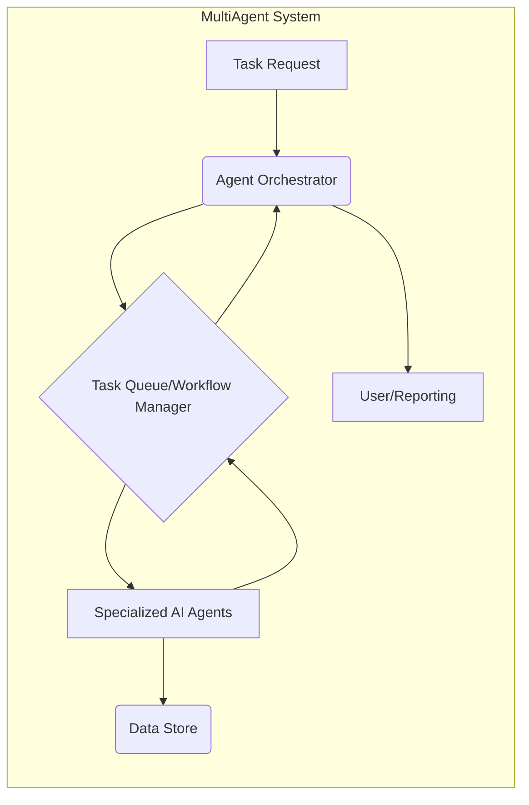
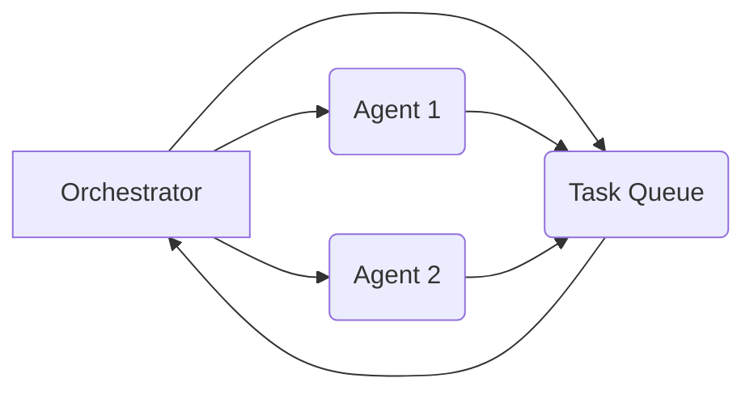
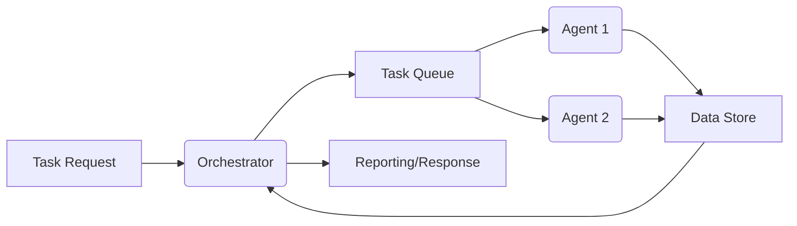

## MultiAgent Repository Architectural Analysis

This analysis assesses the architecture of the `MultiAgent` repository based on the provided information.  The lack of source code limits the depth of the analysis, but we can infer some aspects from the directory structure, file types, and the `README.md`.

### 1. System Architecture Overview

Based on the repository structure and `README.md`, the system appears to be a multi-agent system designed for automating complex organizational tasks.  The system likely comprises the following components:

* **Agent Orchestrator:** A central component responsible for managing and coordinating multiple AI agents.  This component receives task requests, assigns them to appropriate agents, monitors their execution, and manages inter-agent communication.
* **Specialized AI Agents:** Multiple independent agents, each specialized in performing specific tasks or sub-tasks within a larger business process.  These agents could utilize different AI/ML models or algorithms depending on their specialization.
* **Task Queue/Workflow Manager:**  A component responsible for queuing tasks, managing their execution order, and tracking their progress. This could leverage a message queue (like RabbitMQ or Kafka) or a workflow engine (like Airflow).
* **Data Store:** A persistent storage mechanism (database, file system) to store task definitions, agent configurations, and execution history.

**Data Flow:**

1.  A task request enters the system.
2.  The Orchestrator receives the request and determines the appropriate agents.
3.  The Orchestrator assigns the task to the relevant agents via the Task Queue/Workflow Manager.
4.  Agents execute their assigned tasks and update their status in the Task Queue/Workflow Manager.
5.  The Orchestrator monitors agent progress and handles any errors or exceptions.
6.  Results are stored in the Data Store and potentially reported to the user.

**Architectural Patterns:**

* **Microservices:**  The use of specialized AI agents suggests a microservices architecture where each agent is a separate, independent service.
* **Message Queue/Event-Driven Architecture:** The Task Queue/Workflow Manager suggests an event-driven approach with asynchronous communication between components.

### 2. Technology Stack Analysis

The primary language is Python.  Further details are missing about specific frameworks and libraries used.  However, we can make some inferences:

* **Framework Choices:** Without source code, it's impossible to determine specific frameworks. Possible candidates include `FastAPI`, `Flask`, or `Django` for the orchestrator and agent services.  For the message queue, `Celery` with RabbitMQ or Redis is a likely candidate.
* **Potential Technology Debt:**  The absence of a detailed description and potentially missing documentation could lead to technology debt in the long run.  Lack of testing frameworks (beyond `pytest.ini` hinting at pytest usage) is also a significant concern.
* **Modern Alternatives:**  Consider using modern Python frameworks like FastAPI for its performance and async capabilities.  For data storage, a robust database like PostgreSQL or MongoDB would be preferable to a simple file system.

### 3. Component Dependencies

The dependencies between components are not explicitly defined without source code, but we can anticipate a high degree of coupling if not carefully designed:

* **Tight Coupling:**  Without proper abstraction and communication mechanisms (e.g., well-defined APIs, message queues), components might be tightly coupled, making maintenance and scaling difficult.
* **Decoupling Strategies:**  Implement well-defined APIs between the Orchestrator and agents. Use a message queue for asynchronous communication.  Employ dependency injection to minimize hardcoded dependencies.

### 4. Scalability Assessment

Scalability is heavily dependent on the implementation details, but potential limitations exist:

* **Bottlenecks:**  The Orchestrator could become a bottleneck if it's not designed to handle a large number of concurrent tasks and agents.  The database could also be a bottleneck if not properly scaled.
* **Scaling Strategies:**  Employ horizontal scaling for agents and the Orchestrator. Use a distributed message queue and a scalable database. Consider using load balancing techniques.

### 5. Architecture Diagrams

**System Architecture:**

**Component Interaction (Simplified):**

**Data Flow Diagram (Simplified):**

### Actionable Next Steps & Recommendations

**High Priority:**

* **Implement robust testing:** Add comprehensive unit, integration, and end-to-end tests using a framework like pytest. (Implement proper test coverage)
* **Define clear APIs:**  Define clear RESTful or gRPC APIs for communication between the Orchestrator and agents.
* **Choose a message queue:** Select a suitable message queue (e.g., RabbitMQ, Kafka) for asynchronous communication.
* **Select a database:** Choose a scalable database (e.g., PostgreSQL, MongoDB) based on data needs.
* **Document the architecture:**  Create a comprehensive architectural document detailing the system components, data flow, and dependencies.

**Medium Priority:**

* **Implement logging and monitoring:**  Add comprehensive logging and monitoring to track system health and performance.
* **Implement error handling:**  Implement robust error handling and exception management.
* **Consider containerization:** Use Docker to containerize agents and the orchestrator for easier deployment and scaling.

**Low Priority:**

* **Explore serverless options:**  Investigate if serverless functions are suitable for some agents to reduce infrastructure management.
* **Implement CI/CD pipeline:** Set up a CI/CD pipeline for automated building, testing, and deployment.

This analysis provides a starting point. A more detailed analysis requires access to the source code and detailed specifications.  The recommendations prioritize addressing immediate architectural weaknesses and improving maintainability and scalability.
