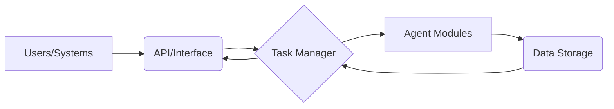
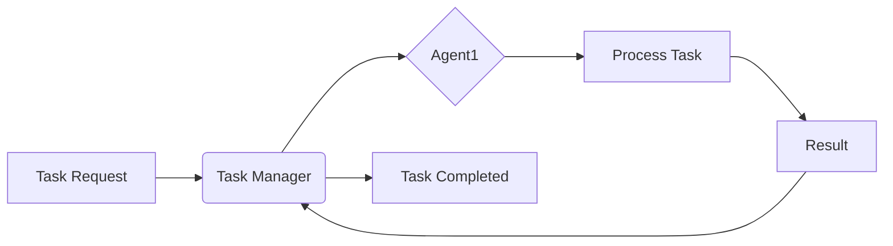

## Architectural Analysis of MultiAgent Repository

This analysis examines the provided information on the `MultiAgent` repository to assess its architecture, identify potential issues, and suggest improvements.  Due to the limited code samples and the absence of detailed descriptions, this analysis will be based on inferences from the repository structure, file types, and the `README.md` snippet.

### 1. System Architecture Overview

Based on the available information, the `MultiAgent` system likely consists of the following components:

* **Agent Core:**  This component manages the lifecycle of individual AI agents, orchestrates their execution, and handles communication between them.  This is inferred from the project's description emphasizing multiple AI agents working together.  The `src` directory likely contains the core logic.

* **Task Manager:** This component receives task requests, assigns them to appropriate agents based on their specialization, and monitors their progress.  This is implied by the description of automatically processing tasks.

* **Agent Modules:** These are individual modules representing specialized AI agents. Each module likely encapsulates specific functionalities and algorithms.  Their organization isn't evident from the provided information.

* **Data Storage:**  The system requires a mechanism to store task details, agent configurations, and results. This might be a database (not specified), or even simple files.

* **API/Interface:** (Inferred) Some form of interface is necessary for users or other systems to interact with the task manager.

**Data Flow:**

1. Users/Systems submit tasks via the API/Interface.
2. The Task Manager receives the task and determines the appropriate agents.
3. The Task Manager assigns tasks to the Agent Modules.
4. Agent Modules process the tasks.
5. Agent Modules return results to the Task Manager.
6. The Task Manager updates the task status and stores results in Data Storage.
7. Results are communicated back to the Users/Systems via the API/Interface.

**Architectural Pattern:**

The system seems to follow a **Microservices** architectural pattern, where individual agents act as independent services.  However, this is a conjecture that requires further investigation.  An **Orchestration** pattern is also evident, with the Task Manager coordinating the agents' activities.

### 2. Technology Stack Analysis

* **Python:** The primary language choice is suitable for AI development due to its rich ecosystem of libraries (NumPy, Scikit-learn, TensorFlow, PyTorch, etc.).

* **Framework Choice (Unknown):**  The provided information doesn't reveal the use of specific frameworks (e.g., Flask, Django, FastAPI for the API).  This needs clarification.

* **Potential Technology Debt:**  Without code inspection, potential technology debt cannot be identified precisely.  However, a lack of clear documentation and potentially missing architectural diagrams suggest a risk of future maintainability challenges.

* **Modern Alternatives (Conditional):**  If a framework isn't used, adopting a modern Python web framework like FastAPI (for its performance and ease of use) could be beneficial.  Consider using a robust task queue (e.g., Celery) for asynchronous task processing.

### 3. Component Dependencies

Precise dependency mapping requires code inspection.  However, potential tight coupling might exist between the Task Manager and Agent Modules if communication is implemented through direct function calls rather than asynchronous messaging or APIs.

**Decoupling Strategies:**

* **Asynchronous Communication:**  Use message queues (e.g., RabbitMQ, Kafka) or publish-subscribe patterns for communication between the Task Manager and Agent Modules.
* **API-driven communication:** Define clear APIs for interaction between components.
* **Dependency Injection:** Employ dependency injection frameworks to manage component dependencies and improve testability.

### 4. Scalability Assessment

The current scalability is unclear.  Scalability challenges could arise from:

* **Single Point of Failure:**  The Task Manager might be a single point of failure if not designed for high availability.
* **Agent Module Bottlenecks:**  Performance limitations might stem from individual Agent Modules if they're not optimized for concurrency or distributed processing.
* **Data Storage Limitations:** The choice of data storage (if not a scalable database) could be a bottleneck.

**Scaling Strategies:**

* **Horizontal Scaling:** Deploy multiple instances of the Task Manager and Agent Modules.
* **Load Balancing:** Distribute incoming requests across multiple Task Manager instances.
* **Distributed Caching:** Implement caching mechanisms to reduce database load.
* **Asynchronous Processing:** Use asynchronous task processing to handle large workloads.
* **Cloud Deployment:** Migrate to a cloud platform (e.g., AWS, Azure, GCP) for easier scaling and resource management.

### 5. Architecture Diagrams

**System Architecture (Mermaid):**

**Component Interaction (Mermaid - Example for one task):**

**(Note:** These are simplified diagrams.  More detailed diagrams would require a more thorough understanding of the codebase.)

### Actionable Next Steps & Recommendations

**High Priority:**

* **Conduct a thorough code review:**  Examine the codebase to understand the actual implementation, identify dependencies, and pinpoint potential bottlenecks.
* **Develop a detailed architectural design:**  Create comprehensive diagrams and documentation outlining the system's architecture, data flow, and component interactions.
* **Implement robust logging and monitoring:**  Add logging and monitoring capabilities to track system performance and identify potential issues.

**Medium Priority:**

* **Choose and implement a modern web framework (if not already done):**  Select a suitable framework (e.g., FastAPI) for the API and implement it.
* **Explore asynchronous task processing:** Evaluate and implement a task queue (e.g., Celery) for improved scalability and responsiveness.

**Low Priority:**

* **Refactor for improved decoupling:** Once the system architecture is well-defined, identify and address tightly coupled components.
* **Explore distributed tracing:**  Implement distributed tracing for better visibility into the system's behavior during task execution.

This analysis provides a starting point for improving the `MultiAgent` system.  Further analysis requires access to the complete codebase and a more detailed understanding of the system's requirements and functionalities.
