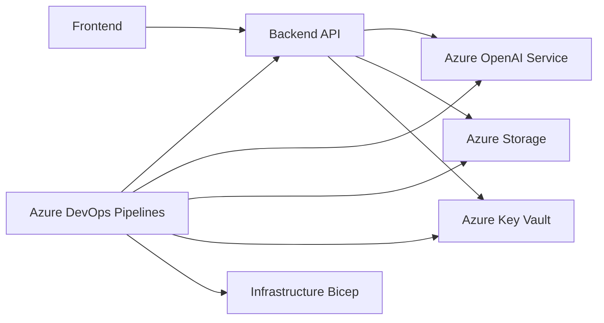

# MultiAgent Repository Architecture Analysis

This analysis examines the architecture of the MultiAgent repository based on the provided code snippets.  The system appears to be a multi-tiered application with frontend, backend, and infrastructure components deployed to Azure.  The architecture leverages several design patterns, including microservices (potentially) and infrastructure-as-code.

## Overall System Architecture

The system consists of at least three main components:

1. **Frontend:** A frontend application (likely built with a framework like Vue.js, indicated by the devcontainer setup), responsible for user interaction and presentation.
2. **Backend:** A backend service (likely Python-based, based on the `requirements.txt` and `pylint` workflow), handling business logic and data processing.
3. **Infrastructure:** Azure infrastructure managed via Bicep and Azure DevOps pipelines, including Azure OpenAI Service, potentially other Azure services (like App Insights, Key Vault, etc.), and container registries.

The interaction flows as follows:  The frontend interacts with the backend API, which in turn interacts with various Azure services.  The infrastructure is provisioned and managed separately using Infrastructure-as-Code (IaC).

## Component Relationships and Dependencies

* **Frontend & Backend:** The frontend depends on the backend API for data and functionality.  The communication likely happens via HTTP requests (REST or gRPC).
* **Backend & Azure Services:** The backend depends on various Azure services for data storage, authentication, and AI capabilities (Azure OpenAI).  The dependencies are managed through environment variables and Azure SDKs.
* **Infrastructure & Everything:** The infrastructure (provisioned via Bicep) underpins the entire system.  The backend and frontend deployments depend on the resources created by the Bicep templates.

## Service Architecture and Modularity

The architecture suggests a move towards a microservices approach, although this isn't explicitly confirmed.  The separation of frontend and backend indicates a degree of modularity. However, the provided code doesn't reveal the internal structure of the backend, so further granularity of microservices cannot be determined.

## Data Flow and System Boundaries

Data flows from the frontend to the backend, then to Azure services for processing and storage.  Results are then sent back to the frontend for display.  The system boundary is defined by the Azure resource group, containing all necessary resources for the application.

## Scalability and Maintainability

* **Scalability:** The Azure infrastructure allows for horizontal scaling of the backend and other services.  Containerization (Docker) further enhances scalability.
* **Maintainability:** The use of IaC (Bicep) improves maintainability by automating infrastructure provisioning and management.  The modularity (frontend/backend separation) also contributes to maintainability.  However, the lack of detailed internal architecture of the backend might hinder maintainability in the long run if it becomes overly complex.

## Architectural Strengths

* **Use of IaC (Bicep):**  Automates infrastructure provisioning and management, improving consistency and reducing errors.
* **Containerization (Docker):** Enables easier deployment, scaling, and portability.
* **Separation of Frontend and Backend:** Promotes modularity and independent development.
* **Azure Services Integration:** Leverages cloud-native services for scalability and functionality.
* **CI/CD Pipelines:** Automated build, test, and deployment processes.

## Architectural Improvements

* **Backend Internal Architecture:**  A more detailed design of the backend architecture is needed.  Consider using a well-defined microservices architecture with clear boundaries and communication patterns.  This would improve maintainability and scalability.
* **Monitoring and Logging:** Implement comprehensive monitoring and logging throughout the system to track performance, identify issues, and improve debugging.  Azure Application Insights could be used for this purpose.
* **API Documentation:**  Create detailed API documentation for the backend to facilitate integration and understanding.
* **Security:** Implement robust security measures, including authentication, authorization, and data encryption, throughout the system.  Leverage Azure Key Vault for secure storage of secrets.
* **Testing:**  Expand testing to include integration tests and end-to-end tests to ensure the system functions correctly as a whole.

This analysis provides a high-level overview. A more in-depth analysis would require access to the complete source code and deployment configurations.