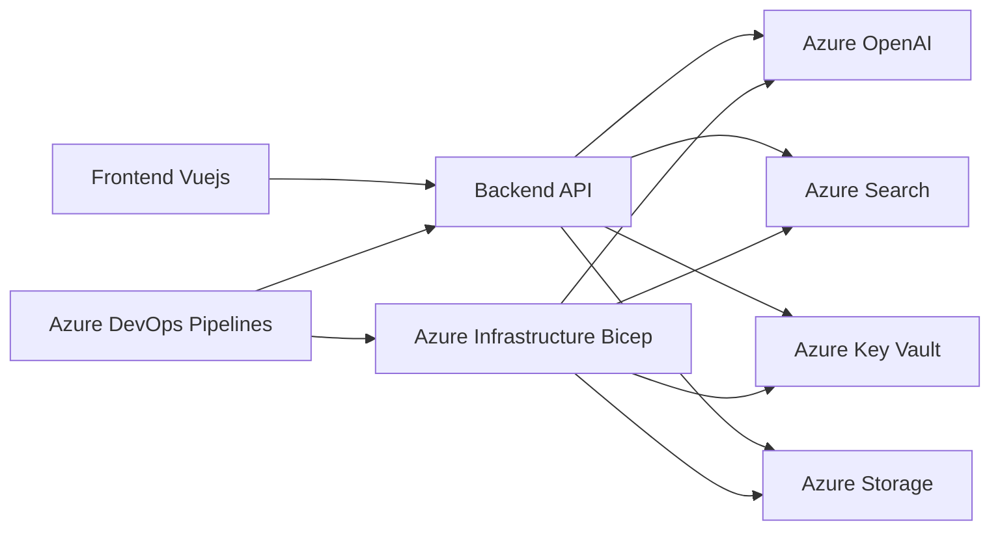

# MultiAgent Repository Architecture Analysis

This analysis examines the architecture of the MultiAgent repository based on the provided code snippets.  The system appears to be a multi-tiered application with frontend, backend, and infrastructure components deployed to Azure.

## Overall System Architecture

The system follows a microservices architecture, with separate frontend and backend components.  The backend likely interacts with Azure services (e.g., Azure OpenAI, Azure Search) via the Azure CLI.  Deployment and infrastructure management are handled through Azure DevOps pipelines and Bicep templates.

The architecture can be visualized as follows:

### Design Patterns

* **Microservices:** The frontend and backend are separate deployable units.
* **Infrastructure as Code (IaC):** Bicep is used to manage Azure infrastructure, promoting consistency and repeatability.
* **CI/CD:** Azure DevOps pipelines automate the build, test, and deployment process.

## Component Relationships and Dependencies

* **Frontend (Vue.js):**  A Vue.js application responsible for user interaction and presentation.  It depends on the backend API for data.
* **Backend API:** Likely a Python-based API (indicated by `requirements.txt` files and Python-related GitHub Actions).  It interacts with various Azure services and manages data persistence.
* **Azure Services:**  The backend relies on Azure services like OpenAI, Search, Key Vault, and Storage.  These services are provisioned and managed using Bicep templates.
* **Azure DevOps Pipelines:**  Orchestrates the build, test, and deployment process.  It uses the `azd` tool to interact with Azure.
* **Bicep Templates:** Define the Azure infrastructure, including resource groups, virtual machines, and Azure services.

## Service Architecture and Modularity

The service architecture is reasonably modular, with separate frontend and backend components. However, the tight coupling between the backend and specific Azure services could be a point of concern.  The extensive use of environment variables in the Azure DevOps pipeline suggests a lack of configuration management best practices.

## Data Flow and System Boundaries

Data flows from the frontend to the backend API, which then interacts with Azure services to retrieve and process data.  The system boundaries are defined by the Azure resource group managed by the Bicep templates.

## Scalability and Maintainability Considerations

* **Scalability:** The microservices architecture allows for independent scaling of the frontend and backend. However, the scalability of the Azure services themselves needs to be considered.
* **Maintainability:** The use of IaC and CI/CD improves maintainability. However, the extensive use of environment variables and lack of clear configuration management could hinder maintainability in the long run.  The monolithic nature of the Bicep templates might also become a challenge as the system grows.

## Architectural Strengths

* **Microservices Architecture:** Promotes independent development, deployment, and scaling.
* **Infrastructure as Code:** Ensures consistency and repeatability in infrastructure provisioning.
* **CI/CD Pipeline:** Automates the build, test, and deployment process.

## Potential Improvements

* **Configuration Management:** Implement a robust configuration management system (e.g., using a configuration server or secret management service) to replace the extensive use of environment variables.
* **Dependency Injection:**  Implement dependency injection in the backend to decouple it from specific Azure services, making it easier to test and swap implementations.
* **Modular Bicep Templates:** Break down the large Bicep templates into smaller, more manageable modules.
* **API Gateway:** Consider using an API gateway to manage routing, authentication, and rate limiting for the backend API.
* **Monitoring and Logging:** Implement comprehensive monitoring and logging to track system performance and identify potential issues.
* **Automated Testing:** Expand automated testing to cover more aspects of the system, including integration tests between the frontend and backend and end-to-end tests.

This analysis provides a high-level overview of the MultiAgent repository architecture. A more detailed analysis would require access to the full source code and deployment configurations.