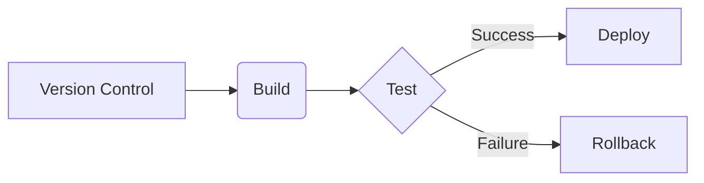

## CI/CD Pipeline Analysis for MultiAgent Repository

This analysis assesses the current state of the MultiAgent repository's CI/CD pipeline and proposes improvements.  The repository lacks explicit CI/CD configuration, so this analysis focuses on building a pipeline from scratch based on best practices.

**1. Current Pipeline Assessment**

* **Existing Setup:** No explicit CI/CD pipeline is defined.  The presence of `.azdo` and `azure.yaml` suggests a potential intention to use Azure DevOps, but no configuration files or details are provided.  The `pytest.ini` file indicates the use of pytest for testing, but no integration with a CI/CD system is evident.
* **Bottlenecks & Inefficiencies:** Without a defined pipeline, potential bottlenecks include manual deployments, lack of automated testing, and slow feedback loops.  This increases risk and slows down development.
* **Deployment Strategies:**  Currently unknown, likely manual deployments with high risk of errors and downtime.


**2. Pipeline Optimization**

* **Build Optimization Strategies:**
    * **Virtual Environments:** Use virtual environments (e.g., `venv`, `conda`) to isolate project dependencies. (High)
    * **Dependency Management:** Employ a requirements file (`requirements.txt`) for reproducible builds. (High)
    * **Build caching:** Implement caching mechanisms for dependencies and build artifacts using tools provided by the CI/CD system (e.g., Azure DevOps caching, GitHub Actions caching). (High)
    * **Code Optimization:** Optimize the Python code for performance (profiling and refactoring). (Medium)
* **Parallel Execution:**
    * **Test parallelization:** Run unit tests in parallel using pytest-xdist or similar tools. (High)
    * **Multi-stage pipelines:** Divide the pipeline into stages (build, test, deploy) to enable parallel execution of non-dependent steps. (High)
* **Caching Opportunities:**
    * **Dependency caching:** Cache downloaded dependencies to speed up subsequent builds. (High)
    * **Test artifact caching:** Cache test results or code coverage reports to reduce redundant computations. (Medium)

**3. Quality Gates**

* **Comprehensive Quality Checks:**
    * **Static Code Analysis:** Integrate tools like flake8 (already present), Pylint, or SonarQube for code style and quality checks. (High)
    * **Unit Tests:**  Expand unit test coverage to ensure high code quality and early error detection. Aim for high test coverage (e.g., >80%). (High)
    * **Integration Tests:** Implement integration tests to verify interactions between different components. (Medium)
    * **Code Coverage:** Track code coverage using tools like coverage.py to identify untested code. (Medium)
* **Automated Testing Integration:**  Integrate pytest with the CI/CD pipeline to automatically run tests on each build. (High)
* **Security Scanning:**
    * **Static Application Security Testing (SAST):** Integrate tools like Bandit or SonarQube to detect security vulnerabilities in the codebase. (Medium)
    * **Dynamic Application Security Testing (DAST):** Use tools like OWASP ZAP to scan deployed applications for vulnerabilities. (Low - depends on deployment environment)


**4. Deployment Strategy**

* **Deployment Patterns:**  Consider a blue-green deployment strategy for minimizing downtime and risk.  A canary deployment could be implemented later for more gradual rollouts. (High)
* **Environment Management:** Use infrastructure-as-code (IaC) tools like Terraform or Ansible to manage environments consistently. (Medium)
* **Rollback Procedures:**  Implement automated rollback procedures in case of deployment failures. This might involve reverting to the previous deployment or using version control to restore a previous state. (High)

**5. Tool Recommendations**

* **CI/CD Tools:**
    * **Azure DevOps:** Aligned with existing hints in the project. Provides a comprehensive platform for CI/CD.
    * **GitHub Actions:** A strong alternative if the project is hosted on GitHub.
* **Integration Strategies:**  The chosen CI/CD system should seamlessly integrate with version control (likely Git), testing frameworks (pytest), and deployment tools.
* **Configuration Examples (Azure DevOps):**

```yaml
# azure-pipelines.yml
trigger:
- main

stages:
- stage: Build
  jobs:
  - job: BuildJob
    steps:
    - task: UsePythonVersion@0
      inputs:
        versionSpec: '3.9'
    - script: |
        python -m venv .venv
        source .venv/bin/activate
        pip install -r requirements.txt
        python setup.py sdist bdist_wheel
    - upload:
        artifacts: '$(Pipeline.Workspace)'
        destination: 'drop'

- stage: Test
  jobs:
  - job: TestJob
    dependsOn: BuildJob
    steps:
    - download: self
      artifact: 'drop'
    - script: |
        source .venv/bin/activate
        pytest --verbose
- stage: Deploy
  jobs:
  - job: DeployJob
    dependsOn: TestJob
    steps:
      # Add deployment steps here (e.g., using Azure App Service Deploy task)
```


**Mermaid Diagram (Simplified Pipeline):**



**Actionable Next Steps:**

1. **(High Priority):** Choose a CI/CD platform (Azure DevOps or GitHub Actions) and set up a basic pipeline.
2. **(High Priority):** Create a `requirements.txt` file and implement virtual environments.
3. **(High Priority):** Integrate pytest into the pipeline for automated testing.
4. **(High Priority):** Implement a blue-green deployment strategy.
5. **(Medium Priority):**  Integrate static code analysis and security scanning tools.
6. **(Medium Priority):** Implement Infrastructure as Code for environment management.
7. **(Low Priority):** Explore canary deployment strategies.

This analysis provides a solid foundation for establishing a robust CI/CD pipeline for the MultiAgent project.  Prioritizing these steps will significantly improve development efficiency, reduce risk, and enhance the overall software quality.
