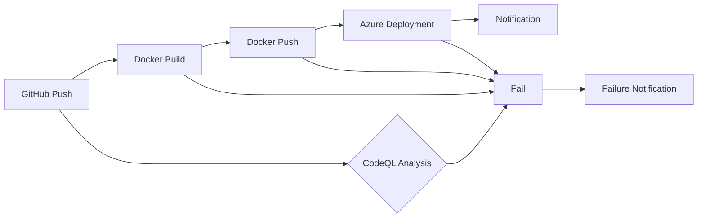

# MultiAgent Repository CI/CD Analysis

This analysis examines the MultiAgent repository's CI/CD pipeline configuration, build and deployment processes, automation opportunities, quality gates, infrastructure as code practices, and provides recommendations for optimization.

## CI/CD Pipeline Configuration

The repository utilizes GitHub Actions for CI/CD, with workflows covering various aspects:

* **CodeQL Analysis (`codeql.yml`):** Performs static code analysis for JavaScript/TypeScript and Python, identifying potential security vulnerabilities and code quality issues.  This is a good practice for improving code quality and security.  However, the build-mode is set to `none` for both languages, which might miss some potential issues if the languages require compilation steps.  Consider adjusting the `build-mode` to `auto` or `manual` (with appropriate build commands) depending on the project's needs.

* **Docker Build and Push (`docker-build-and-push.yml`):** Builds Docker images for frontend and backend components, pushing them to an Azure Container Registry (ACR) upon pushes to `main`, `dev`, `demo`, and `hotfix` branches.  The use of historical tags (`TAG_${DATE_TAG}_${RUN_ID}`) is a valuable addition for traceability.  This workflow could be improved by adding image scanning and vulnerability checks before pushing to the registry.

* **Azure Deployment (`deploy.yml` and `deploy-waf.yml`):** These workflows deploy infrastructure and applications to Azure using Bicep templates.  They include quota checks, resource group creation/deletion, and notification mechanisms using Logic Apps.  The inclusion of resource cleanup is crucial for cost optimization. However, the hardcoded `eastus` location in the resource deletion step (`deploy-waf.yml`) should be removed and replaced with a variable to allow for flexibility in deployment regions.  The retry mechanism for resource deletion is a good addition, but the retry intervals could be made more dynamic based on resource type.

* **Dependabot Integration (`dependabot.yml` and `scheduled-Dependabot-PRs-Auto-Merge.yml`):** Dependabot manages dependency updates, creating pull requests for changes.  A separate workflow (`scheduled-Dependabot-PRs-Auto-Merge.yml`) automatically merges these PRs after rebasing and conflict resolution, which is a significant automation improvement.  However, the hardcoded "prefer-theirs" strategy in the rebase might not always be the best approach.  Consider adding a configurable merge strategy.

* **Release Creation (`create-release.yml`):** This workflow uses `semantic-release` to automate the release process based on commit messages, generating release notes and publishing to GitHub.  This is a best practice for version control and release management.

* **Other Workflows:** The repository includes workflows for Azure template validation (`azure-dev.yml`), Pylint (`pylint.yml`), and a PR title checker (`pr-title-checker.yml`), demonstrating a commitment to code quality and consistent practices.  The stale bot (`stale-bot.yml`) is also a valuable addition for managing stale issues and PRs.

* **Azure DevOps Pipeline (`azure-dev.yml`):** This pipeline uses `azd` for provisioning and deploying infrastructure and applications to Azure.  It leverages an Azure service connection for authentication.  The commented-out alternative `azd` installation method should be removed for clarity.  The large number of environment variables suggests potential for improvement through configuration management.

## Build and Deployment Processes

The build process involves separate Docker builds for frontend and backend, leveraging Dockerfiles.  Deployment to Azure is automated using Bicep templates, which is a good practice for Infrastructure as Code (IaC).

## Automation Opportunities

The CI/CD pipeline is already highly automated, but further improvements are possible:

* **Automated testing:** Integrate unit, integration, and end-to-end tests into the pipeline to ensure code quality and prevent regressions.
* **Environment-specific configurations:** Implement a more robust configuration management system to handle environment-specific settings (e.g., using environment variables or configuration files) instead of hardcoding values.
* **Automated rollback:** Implement automated rollback mechanisms in case of deployment failures.
* **Centralized logging and monitoring:** Implement centralized logging and monitoring to track pipeline execution and application performance.

## Quality Gates and Testing Integration

CodeQL analysis provides a static code analysis quality gate.  However, the lack of automated testing is a significant gap.  Integrating automated tests (unit, integration, end-to-end) would significantly improve the pipeline's ability to catch bugs early.

## Infrastructure as Code Practices

The use of Bicep templates for infrastructure deployment is a strong IaC practice.  However, consider using a version control system (like Git) for managing the Bicep templates themselves to track changes and enable rollbacks.

## Recommendations

1. **Integrate automated testing:** Add unit, integration, and end-to-end tests to the pipeline.
2. **Improve configuration management:** Use a configuration management system (e.g., environment variables, configuration files) to manage environment-specific settings.
3. **Implement automated rollback:** Add mechanisms to automatically roll back deployments in case of failures.
4. **Centralize logging and monitoring:** Implement a centralized logging and monitoring system.
5. **Enhance Docker image security:** Integrate image scanning and vulnerability checks before pushing Docker images to the registry.
6. **Version control Bicep templates:** Store Bicep templates in a version control system (Git) for better management and traceability.
7. **Refactor environment variables:** Reduce the number of environment variables by using more structured configuration methods.
8. **Dynamic retry intervals:** Make the retry intervals in resource deletion more dynamic based on resource type.
9. **Remove hardcoded locations:** Replace hardcoded locations (like `eastus`) with variables for better flexibility.
10. **Configurable merge strategy:** Allow for configurable merge strategies in the Dependabot auto-merge workflow.

## Mermaid Diagram (Simplified Pipeline Visualization)

This diagram provides a simplified representation of the pipeline flow.  A more detailed diagram could be created to represent the individual workflows and their interactions.  Note that this diagram omits several workflows for brevity.