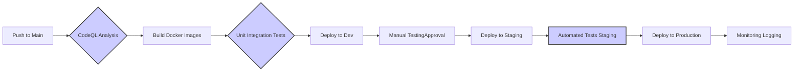

# MultiAgent Repository CI/CD Analysis

This analysis examines the MultiAgent repository's CI/CD pipeline configuration, build and deployment processes, automation opportunities, quality gates, infrastructure as code practices, and provides recommendations for optimization.

## CI/CD Pipeline Configuration

The repository utilizes GitHub Actions for its CI/CD pipeline, encompassing various workflows:

* **`azure-dev.yml`**: Validates Azure Bicep templates.  This workflow relies on secrets for Azure authentication and environment variables for deployment parameters.  It lacks robust error handling and notification mechanisms beyond a simple `print result`.

* **`agnext-biab-02-containerimage.yml`**: Builds and publishes a Docker image to GitHub Container Registry (GHCR).  This workflow is well-structured, using standard actions for checkout, login, and build/push.

* **`codeql.yml`**:  Performs CodeQL analysis for security vulnerabilities.  This is a standard CodeQL workflow and appears correctly configured.

* **`create-release.yml`**: Uses the `semantic-release-action` to manage releases based on commit messages.  This workflow generates release notes and pushes tags to GitHub.

* **`deploy-waf.yml` & `deploy.yml`**: These workflows handle the deployment to Azure.  They perform quota checks, create resource groups, deploy Bicep templates, and implement resource cleanup.  These workflows include email notifications on failure and quota issues.  However, the resource cleanup process could be improved (see recommendations).

* **`docker-build-and-push.yml`**: Builds and optionally pushes Docker images to Azure Container Registry (ACR).  This workflow uses a conditional push based on the branch, and creates both `latest` and historical tags.

* **`pr-title-checker.yml`**: Validates pull request titles using a semantic-release plugin.

* **`pylint.yml`**: Runs `flake8` and `pylint` on the backend code.  This workflow needs improvement (see recommendations).

* **`scheduled-Dependabot-PRs-Auto-Merge.yml`**: Automates the merging of Dependabot pull requests. This workflow is complex and attempts multiple merge strategies.

* **`stale-bot.yml`**: Manages stale issues and pull requests.

**Strengths:**

* **Modular Workflows:** The pipeline is broken down into smaller, manageable workflows.
* **Automated Testing (Partial):** CodeQL analysis and `pylint` provide some level of automated testing.
* **Infrastructure as Code (IaC):** Uses Bicep for infrastructure provisioning.
* **Automated Release Management:**  `semantic-release-action` automates the release process.
* **Scheduled Deployments:**  Scheduled deployments are configured for both `deploy-waf.yml` and `deploy.yml`.
* **Dependabot Integration:**  Dependabot is used for dependency updates.
* **Robust Error Handling (Partial):**  Some workflows have error handling and notification mechanisms.

**Weaknesses:**

* **Inconsistent Error Handling:** Error handling and notification are not consistently implemented across all workflows.
* **Limited Testing:**  Testing is limited to static analysis and lacks unit/integration tests.
* **Missing Deployment Stages:**  The pipeline lacks distinct stages (e.g., development, staging, production).
* **Resource Cleanup Issues:** Resource cleanup in `deploy-waf.yml` and `deploy.yml` could be more robust.
* **Overly Complex Auto-Merge:** The `scheduled-Dependabot-PRs-Auto-Merge.yml` workflow is overly complex and could be simplified.
* **Missing Artifact Management:** There's no explicit artifact management for storing and deploying build outputs.

## Build and Deployment Processes

The build process involves building Docker images for frontend and backend components. Deployment uses Bicep templates to provision Azure resources.  The deployment workflows include a quota check, which is a good practice.

## Automation Opportunities

* **Automated Unit and Integration Tests:** Integrate unit and integration tests into the pipeline to improve code quality and catch bugs early.
* **Automated Infrastructure Testing:**  Implement automated tests for the Bicep templates to ensure they deploy correctly.
* **Environment-Specific Configurations:**  Implement environment-specific configurations (dev, staging, prod) to manage different settings.
* **Improved Logging and Monitoring:**  Enhance logging and monitoring to track pipeline execution and identify issues.
* **Centralized Secret Management:**  Consider using a dedicated secret management solution instead of relying solely on GitHub secrets.

## Quality Gates and Testing Integration

The pipeline includes CodeQL analysis and `pylint`, but lacks comprehensive unit and integration tests.  Adding these would significantly improve the quality gates.

## Infrastructure as Code Practices

The use of Bicep for infrastructure provisioning is a good practice.  However, the templates should be thoroughly tested.

## Recommendations

1. **Enhance Error Handling and Notifications:** Implement consistent error handling and notifications across all workflows.  Use a centralized logging and monitoring system.

2. **Implement Comprehensive Testing:**  Add unit and integration tests for both frontend and backend components.  Integrate these tests into the pipeline.

3. **Introduce Deployment Stages:**  Implement distinct deployment stages (dev, staging, prod) to allow for testing and gradual rollouts.

4. **Improve Resource Cleanup:**  The resource cleanup process in `deploy-waf.yml` and `deploy.yml` should be more robust and handle potential errors.  Consider using a dedicated cleanup workflow.

5. **Simplify Auto-Merge Workflow:** Refactor the `scheduled-Dependabot-PRs-Auto-Merge.yml` workflow to be more concise and easier to maintain.

6. **Implement Artifact Management:**  Use a dedicated artifact repository to store and manage build outputs.

7. **Improve Pylint Workflow:** The `pylint.yml` workflow should be updated to include `pylint` in addition to `flake8`.  It should also specify the correct configuration file and handle errors more gracefully.

8. **Centralized Configuration:** Use a configuration file to manage environment variables and other settings, rather than hardcoding them in multiple workflows.

9. **Infrastructure as Code Testing:** Implement tests for the Bicep templates to ensure they deploy correctly.  Consider using tools like `az bicep test`.

10. **Security Best Practices:** Regularly review and update security dependencies and configurations.

## Mermaid Diagram (Simplified Pipeline)

This diagram shows a simplified, improved pipeline structure.  The actual pipeline is more complex, but this illustrates the key stages and the need for improved testing and staging environments.  Note the use of square brackets for node labels and separate arrows for multiple targets.