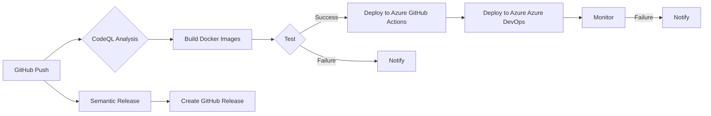

# MultiAgent Repository CI/CD Analysis

This analysis examines the MultiAgent repository's CI/CD pipeline, build and deployment processes, automation opportunities, quality gates, infrastructure as code practices, and provides recommendations for optimization.

## CI/CD Pipeline Configuration

The repository utilizes GitHub Actions and Azure DevOps pipelines for CI/CD.

**GitHub Actions:**

* **`agnext-biab-02-containerimage.yml`**: Builds and publishes a Docker image to GitHub Container Registry (GHCR) upon pushes to `main`, `test`, and `release` branches.  This workflow is specific to the `agnext-biab-02` directory.
* **`azure-dev.yml`**: Validates Azure Bicep templates. This workflow relies on secrets for Azure authentication and environment variables for deployment parameters.  It lacks a deployment step.
* **`codeql.yml`**: Configures CodeQL code scanning for several languages (JavaScript/TypeScript, Python). Scheduled runs are configured.
* **`create-release.yml`**: Uses the `codfish/semantic-release-action` to create GitHub releases based on semantic versioning.  This workflow leverages conventional commits for version bumping and changelog generation.
* **`deploy-waf.yml`**: Deploys and validates a Web Application Firewall (WAF) configuration to Azure.  This workflow incorporates quota checks, error handling, and resource cleanup.  It uses Bicep for infrastructure as code.
* **`deploy.yml`**: Deploys and validates a general Azure deployment.  This workflow is very similar to `deploy-waf.yml` but lacks the WAF-specific parameters.  It also incorporates quota checks, error handling, and resource cleanup.  It uses Bicep for infrastructure as code.
* **`docker-build-and-push.yml`**: Builds Docker images for frontend and backend components, optionally pushing to Azure Container Registry (ACR).  It uses different tags based on the branch and includes historical tags.
* **`pr-title-checker.yml`**: Enforces semantic PR titles using `amannn/action-semantic-pull-request`.
* **`pylint.yml`**: Runs PyLint and flake8 on the backend Python code.
* **`scheduled-Dependabot-PRs-Auto-Merge.yml`**: Automates the merging of Dependabot pull requests targeting the `dependabotchanges` branch.  It handles conflicts and uses multiple merge strategies.
* **`stale-bot.yml`**: Manages stale issues, pull requests, and branches.

**Azure DevOps Pipeline (`azure-dev.yml`):**

* This pipeline deploys to Azure using `azd`. It uses a service connection configured via `azd pipeline config`.  It provisions infrastructure and deploys the application.  It relies heavily on environment variables for configuration.

**Overall Pipeline Structure:**  The GitHub Actions workflows are well-structured and cover various aspects of the CI/CD process.  However, there's a significant amount of duplication between `deploy.yml` and `deploy-waf.yml`.  The Azure DevOps pipeline complements the GitHub Actions workflows, but the reliance on environment variables makes it less maintainable.

## Build and Deployment Processes

* **Backend:** Python-based, using `requirements.txt` for dependency management. Dockerized for deployment.
* **Frontend:**  The frontend technology is not explicitly defined, but it also uses `requirements.txt` and is Dockerized.
* **Deployment:**  Deployment to Azure is handled by both GitHub Actions and Azure DevOps.  The Azure DevOps pipeline uses `azd`, while GitHub Actions uses Azure CLI and Bicep.  Both approaches use service principals for authentication.

## Automation Opportunities

* **Consolidate Deployment Workflows:**  The significant overlap between `deploy.yml` and `deploy-waf.yml` in GitHub Actions should be addressed by creating a single, more flexible workflow that handles both deployments.  This would reduce redundancy and improve maintainability.
* **Parameterize Azure DevOps Pipeline:** Reduce the reliance on environment variables in the Azure DevOps pipeline by using pipeline parameters or a configuration file.
* **Automated Testing:**  While PyLint and flake8 are used for static code analysis, there's no evidence of automated unit or integration tests.  Adding these would significantly improve the quality and reliability of the CI/CD process.
* **Infrastructure as Code (IaC) Standardization:** While Bicep is used for IaC in some workflows, consistency should be enforced across all deployments.
* **Centralized Configuration:**  Consider using a configuration management tool (e.g., HashiCorp Vault) to securely manage secrets and environment variables across different CI/CD pipelines.
* **Artifact Management:** Implement a robust artifact management system (e.g., using Azure Artifacts or JFrog Artifactory) to manage and version Docker images and other build artifacts.

## Quality Gates and Testing Integration

* **Static Code Analysis:**  PyLint and flake8 are integrated for Python code.  Similar tools should be used for other languages (if applicable).
* **CodeQL:**  Provides dynamic code analysis for security vulnerabilities.
* **Automated Testing (Missing):**  The lack of automated unit and integration tests is a major gap.  Adding these would significantly improve the quality and reliability of the software.
* **Manual Testing:**  The `deploy-waf.yml` and `deploy.yml` workflows include steps to fetch OpenAI resource names after deployment, implying some manual validation is performed.  This should be automated.

## Infrastructure as Code (IaC) Practices

* **Bicep:**  Used for deploying Azure resources, which is a good practice.
* **Consistency:**  Ensure consistent use of Bicep across all deployments.
* **Version Control:**  Bicep templates are version-controlled, which is crucial for IaC.

## Recommendations

1. **Consolidate Deployment Workflows:** Refactor the GitHub Actions workflows to reduce redundancy. Create a single workflow that can deploy both the general application and the WAF, using parameters to differentiate.
2. **Implement Automated Testing:**  Add comprehensive unit and integration tests for both the frontend and backend.  Integrate these tests into the CI/CD pipeline.
3. **Improve Azure DevOps Pipeline:**  Replace environment variables with pipeline parameters or a configuration file for better maintainability and security.
4. **Standardize IaC:**  Enforce consistent use of Bicep across all deployments.  Consider using modules to promote reusability.
5. **Centralize Configuration Management:**  Use a dedicated secrets management tool to securely store and manage sensitive information.
6. **Implement Artifact Management:**  Use a dedicated artifact repository to manage and version build artifacts.
7. **Enhance Monitoring and Logging:**  Integrate monitoring and logging tools to track deployments and identify potential issues.
8. **Improve Resource Cleanup:**  The resource cleanup in `deploy.yml` and `deploy-waf.yml` could be improved by using more robust methods to ensure complete deletion.  Consider adding checks to confirm successful deletion.

## Mermaid Diagram (Simplified Workflow Visualization)

This diagram simplifies the workflow, focusing on the key stages.  A more detailed diagram could be created to represent the individual workflows and their interactions.  Note that the diagram omits many details for brevity.

This analysis provides a starting point for improving the MultiAgent repository's CI/CD process.  Implementing these recommendations will lead to a more robust, reliable, and maintainable system.