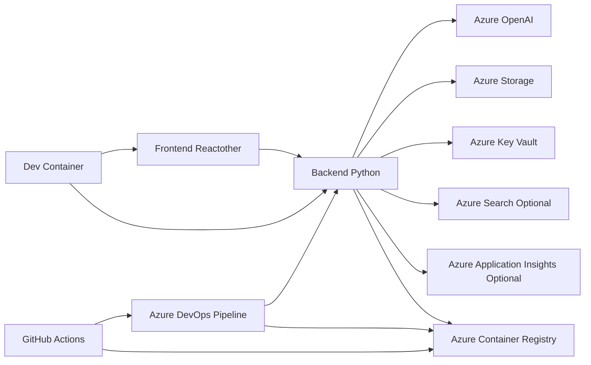

# MultiAgent Repository High-Level Design Analysis

This document provides a high-level design analysis of the MultiAgent repository based on the provided code and configuration files.  The analysis focuses on identifying key components, their interactions, and potential areas for improvement.  Due to the limited code snippets, this analysis is based on inferred functionality and best practices.  A more comprehensive analysis would require access to the complete source code.

## I. High-Level System Architecture

The MultiAgent system appears to be a multi-tiered application consisting of a frontend, backend, and infrastructure deployed on Azure.  The system likely utilizes Azure services such as Azure OpenAI, Azure Container Registry, and potentially others based on environment variables.

**Components:**

* **Frontend:** A user interface (likely React or a similar framework) responsible for user interaction and presentation of data.
* **Backend:** A Python-based API (likely using a framework like Django or Flask) handling business logic, data processing, and interaction with Azure services.
* **Azure Services:**  A suite of Azure services providing infrastructure, AI capabilities, data storage, and monitoring.  Specifically, Azure OpenAI is explicitly used, while others are inferred based on environment variables.
* **Dev Container:** A development container for consistent development environments.
* **CI/CD:**  A robust CI/CD pipeline using Azure DevOps and GitHub Actions for automated building, testing, and deployment.

## II. Low-Level Component Design Details

**A. Backend (Python):**

*   **Technology Stack:** Python, likely a framework like Django or Flask, and potentially other libraries based on `requirements.txt`.
*   **Functionality:**  Handles API requests from the frontend, interacts with Azure OpenAI for AI-related tasks (e.g., language processing, embedding generation), manages data persistence (likely using an ORM and Azure Storage), and potentially integrates with other Azure services.
*   **Data Access:**  Uses an ORM (Object-Relational Mapper) to interact with a database (schema details are missing).  The system uses Azure Key Vault for secure storage of secrets.

**B. Frontend (React/other):**

*   **Technology Stack:**  Likely React, Vue, or Angular based on the presence of frontend-related files and extension installations in `devcontainer.json`.
*   **Functionality:**  Provides a user interface for interacting with the backend API, displaying results, and managing user input.
*   **State Management:**  The state management approach (Redux, Context API, etc.) is unknown without access to the source code.

**C. Database:**

*   The database schema and data models are not explicitly defined in the provided files.  Further investigation is needed to understand the database structure and relationships.

**D. API Documentation and Interfaces:**

*   No explicit API documentation is provided.  Best practice would involve using tools like Swagger or OpenAPI to document the API endpoints, request/response formats, and authentication mechanisms.

## III. System Integration Patterns

*   **Microservices Architecture (Inferred):** The system might be designed as a collection of microservices, with the frontend and backend as separate services.
*   **Asynchronous Communication:**  The interaction between the frontend and backend might utilize asynchronous communication patterns (e.g., WebSockets) for real-time updates.
*   **Event-Driven Architecture (Potential):**  The system could leverage an event-driven architecture for communication between different components and services.

## IV. Recommendations

*   **Detailed Design Documentation:** Create comprehensive design documents including detailed diagrams, API specifications (using Swagger/OpenAPI), database schemas, and data models.
*   **API Documentation:** Implement a robust API documentation system (Swagger/OpenAPI) to improve maintainability and developer experience.
*   **Error Handling and Logging:**  Implement comprehensive error handling and logging throughout the application for better debugging and monitoring.
*   **Security Best Practices:**  Implement robust security measures, including input validation, authentication, authorization, and secure storage of sensitive data (Azure Key Vault is a good start).
*   **Testing:**  Implement a comprehensive testing strategy, including unit, integration, and end-to-end tests.
*   **Monitoring and Alerting:**  Set up monitoring and alerting using Azure Application Insights or similar tools to track system performance and identify potential issues.

This analysis provides a starting point for understanding the MultiAgent system.  A more detailed and accurate analysis would require access to the complete source code and detailed design specifications.