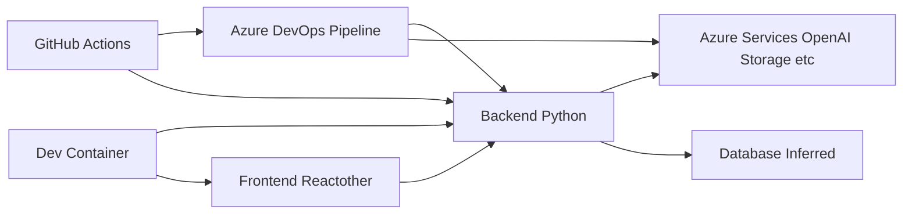

# MultiAgent Repository High-Level Design Analysis

This document provides a high-level design analysis of the MultiAgent repository based on the provided code and configuration files.  The analysis focuses on system architecture, component interactions, and deployment processes.  Due to the lack of explicit code defining APIs, database schemas, and data models, these aspects will be inferred based on the available information.

## I. System Architecture

The MultiAgent system appears to be a multi-tiered application consisting of a frontend, a backend, and infrastructure deployed on Azure.

**Components:**

* **Frontend:**  A client-side application (likely React or a similar framework) responsible for user interaction and presentation.  The `./src/frontend` directory suggests this component.
* **Backend:** A server-side application (Python based) handling business logic, API requests, and data processing. The `./src/backend` directory indicates this component.  It uses `requirements.txt` for dependency management.
* **Database:** The type of database is not explicitly specified, but it's inferred to exist based on the backend's role.  Further investigation is needed to determine the specific database technology used.
* **Azure Services:** The system leverages various Azure services, including Azure OpenAI, storage, and potentially others (Application Insights, Key Vault, etc.), as indicated by environment variables in the Azure DevOps pipeline.
* **Azure DevOps Pipeline:**  An Azure DevOps pipeline (`azure-dev.yml`) automates the deployment process to Azure. It uses `azd` for provisioning and deployment.
* **GitHub Actions:** Multiple GitHub Actions workflows are defined for various purposes: Docker image building and publishing, code quality checks (CodeQL, PyLint), release creation, and automated deployments to Azure.  These workflows orchestrate the CI/CD process.
* **Dev Container:** A development container configuration (`devcontainer.json`) is provided to standardize the development environment, including necessary extensions and tools.

## II. Component Interactions

The frontend communicates with the backend via API calls (the specific API design is not provided). The backend interacts with the database for persistent data storage and with Azure services for external functionalities (e.g., OpenAI for AI capabilities). The Azure DevOps pipeline and GitHub Actions workflows manage the build, testing, and deployment processes.

## III. Deployment Process

The deployment process is automated using Azure DevOps and GitHub Actions.  The Azure DevOps pipeline utilizes `azd` for infrastructure provisioning and application deployment.  GitHub Actions workflows trigger the pipeline upon code pushes to the `main` branch and perform various checks and tasks before deployment.  The `deploy.yml` and `deploy-waf.yml` files suggest separate deployment workflows, potentially for different environments or components.  The `deploy-waf.yml` workflow includes a quota check before deployment, indicating resource management considerations.

## IV. Inferred API Documentation and Interfaces

The repository lacks explicit API documentation. However, based on the system architecture, we can infer the existence of RESTful APIs exposed by the backend to the frontend.  These APIs likely handle requests for data retrieval, updates, and other functionalities.  Further investigation is needed to determine the specific API endpoints, request/response formats, and authentication mechanisms.

## V. Inferred Database Schema and Data Models

The repository doesn't provide details about the database schema and data models.  This information is crucial for understanding data storage and retrieval mechanisms.  Further investigation is required to determine the database technology (e.g., PostgreSQL, MySQL, MongoDB), table structures, relationships between tables, and data types.

## VI. System Integration Patterns

The system utilizes several integration patterns:

* **API-driven integration:** The frontend and backend communicate through APIs.
* **Azure service integration:** The backend integrates with various Azure services using their respective SDKs or APIs.
* **CI/CD pipeline:**  The build, test, and deployment processes are integrated through Azure DevOps and GitHub Actions.

## VII. Recommendations

* **API Documentation:**  Generate comprehensive API documentation (e.g., using OpenAPI/Swagger) to clearly define the interfaces between the frontend and backend.
* **Database Schema Design:**  Document the database schema and data models using ER diagrams or similar techniques.
* **Detailed Component Design:**  Provide more detailed design specifications for each component, including class diagrams, sequence diagrams, and detailed descriptions of functionalities.
* **Security Considerations:**  Implement robust security measures throughout the system, including authentication, authorization, and data protection.
* **Monitoring and Logging:**  Integrate monitoring and logging capabilities to track system performance and identify potential issues.
* **Error Handling:**  Implement comprehensive error handling mechanisms to gracefully handle exceptions and provide informative error messages.
* **Testing Strategy:**  Develop a comprehensive testing strategy encompassing unit tests, integration tests, and end-to-end tests.

This analysis provides a starting point for understanding the MultiAgent system.  Further investigation and detailed design documentation are needed to fully capture the system's complexity and ensure its robustness and maintainability.