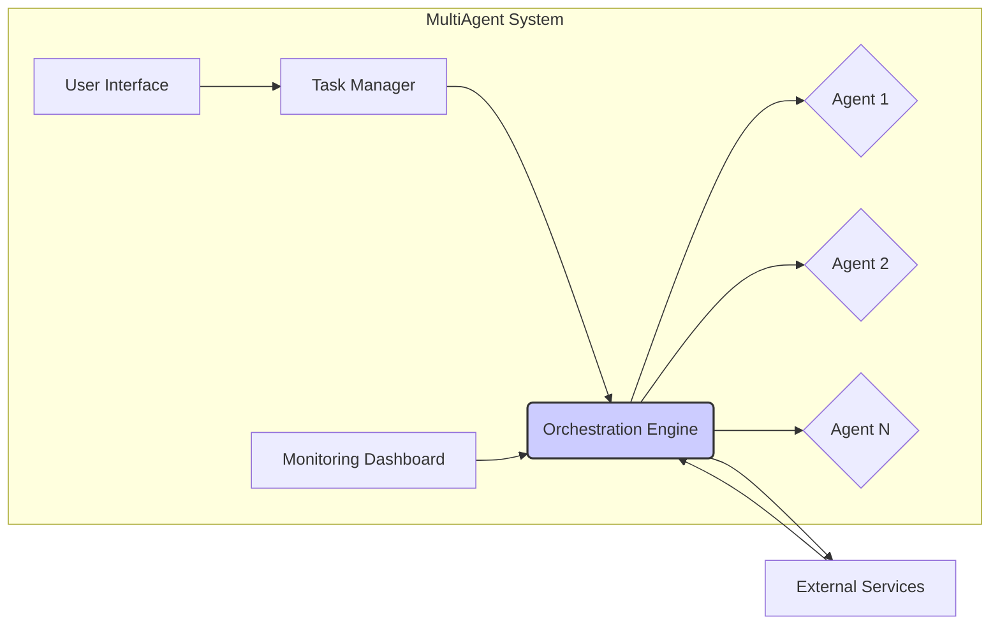

## MultiAgent System Design Analysis

Based on the provided repository structure and snippets, the `MultiAgent` project appears to be a framework for building a multi-agent system, likely focused on automating business tasks.  The lack of detailed code prevents a precise analysis, but we can infer a high-level design based on the available information.

**1. System Design Overview**

The system will likely consist of multiple AI agents, a central orchestration engine, and interfaces for task definition and monitoring.

**High-Level Architecture:**



* **System Boundaries:** The system boundary encompasses the orchestration engine, agents, task management, and user interfaces.
* **Interfaces:**  User interface (UI) for task submission and monitoring, APIs for agent communication, and interfaces to external services (databases, other systems).
* **External Dependencies:**  This will likely depend on external services such as databases (for persistent storage of tasks and agent data), message queues (for asynchronous communication between components), and potentially cloud services (for scaling and resource management).


**2. Component Design**

* **Task Manager:** Responsible for receiving, validating, and scheduling tasks.  It will likely interact with a database to persist task information.
* **Orchestration Engine:** The core component, responsible for coordinating the execution of tasks by assigning them to appropriate agents, monitoring their progress, and handling failures.  This component needs robust error handling and task recovery mechanisms.
* **AI Agents:** Specialized agents responsible for performing specific tasks.  These could be implemented using various AI techniques (e.g., rule-based systems, machine learning models).  Each agent will have a well-defined interface for communication with the orchestration engine.
* **User Interface:** A web or command-line interface for users to define tasks, monitor progress, and manage the system.
* **Monitoring Dashboard:** Provides real-time insights into the system's performance, including task completion rates, agent utilization, and error logs.

**Component Interactions:**  The Task Manager receives tasks from the UI, assigns them to the Orchestration Engine, which then distributes them among the appropriate agents. Agents report their progress and results back to the Orchestration Engine, which updates the Task Manager and the Monitoring Dashboard.

**3. Data Architecture**

* **Data Models:**
    * **Task:** `task_id`, `description`, `status`, `assigned_agent`, `creation_time`, `completion_time`, `result`.
    * **Agent:** `agent_id`, `type`, `status`, `capabilities`.
    * **Agent_Task_History:** `agent_id`, `task_id`, `start_time`, `end_time`, `status`.

* **Data Storage:** A relational database (PostgreSQL, MySQL) is recommended for structured data. A NoSQL database (MongoDB, Cassandra) could be considered for unstructured data or if high scalability is required.
* **Data Flow:**  Tasks flow from the UI to the Task Manager, then to the Orchestration Engine, and finally to the assigned agents. Results flow in the reverse direction.

**4. API Design**

* **API Architecture:** RESTful API is recommended for its simplicity and widespread adoption.  GraphQL could be considered for complex queries.
* **API Versioning:** Semantic versioning (e.g., v1, v2) is recommended.
* **API Documentation:** Swagger/OpenAPI specification should be used to generate interactive API documentation.

**Example API Endpoint (Task Creation):**

```json
POST /v1/tasks
{
  "description": "Process invoices for January",
  "agent_type": "invoice_processor"
}
```

**5. Design Patterns**

* **Orchestration Engine:**  Consider using a workflow engine (e.g., Apache Camel, Zeebe) to manage complex task flows.
* **Agent Communication:**  Message queues (e.g., RabbitMQ, Kafka) for asynchronous communication between the orchestration engine and agents.
* **Design Patterns:**  Observer pattern for monitoring agent status, Strategy pattern for selecting agents based on capabilities.
* **Architectural Pattern:** Microservices architecture is well-suited for a multi-agent system, allowing independent scaling and deployment of agents.


**Actionable Next Steps:**

* **High Priority:**
    * Define detailed requirements for each component.
    * Design a comprehensive database schema.
    * Develop a detailed API specification using Swagger/OpenAPI.
* **Medium Priority:**
    * Choose specific technologies for each component (database, message queue, workflow engine).
    * Implement a prototype of the orchestration engine and a sample agent.
* **Low Priority:**
    * Develop comprehensive UI and monitoring dashboard.
    * Implement advanced features like error handling and task recovery.


**Recommendations Summary:**

| Recommendation                     | Priority | Justification                                                                 |
|--------------------------------------|----------|-----------------------------------------------------------------------------|
| Use a relational database           | High     | Suitable for structured data and well-established tooling.                    |
| Employ RESTful API design            | High     | Simple, widely adopted, and well-understood.                               |
| Implement a message queue           | Medium   | Enables asynchronous communication and improves scalability.                  |
| Consider a workflow engine          | Medium   | Simplifies complex task orchestration.                                      |
| Use semantic versioning for APIs    | Medium   | Ensures compatibility and allows for iterative development.                  |
| Microservices architecture           | Medium   | Enables independent scaling and deployment of agents.                        |
| Implement robust error handling      | High     | Critical for reliability in a multi-agent system.                            |


This analysis provides a foundation for building the `MultiAgent` system. Further detailed design and implementation will depend on specific requirements and the chosen technologies.  The lack of detailed code and a formal description severely limits the accuracy of this high-level design.  More information about the specific tasks to be automated and the nature of the agents is crucial for further refinement.
