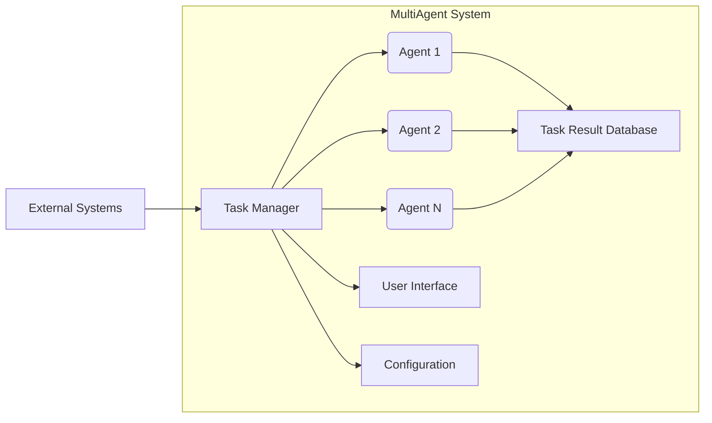

## MultiAgent System Design Analysis

Based on the provided information, the `MultiAgent` repository appears to be a framework for building a multi-agent system for automating complex business tasks.  The lack of detailed code prevents a precise analysis, but we can create a plausible High-Level Design (HLD) based on the available information and common practices in multi-agent system development.

**1. System Design Overview**

The system aims to orchestrate multiple AI agents to perform complex tasks.  It likely involves a central control system managing agent assignments, task allocation, and result aggregation.  Individual agents will be specialized for specific tasks, potentially utilizing different AI techniques (e.g., machine learning, rule-based systems).

**System Architecture Diagram:**

* **System Boundaries:** The system boundary encompasses the Task Manager, Agents, Task Result Database, User Interface, and Configuration.
* **Interfaces:**
    * **Task Manager - Agent:**  A message queue or RPC-based interface for task assignment and result reporting.
    * **Task Manager - User Interface:**  A RESTful API or similar for user interaction.
    * **Task Manager - External Systems:**  APIs or data integrations for accessing external data and systems.
* **External Dependencies:**  The system will depend on external data sources, potentially cloud services (indicated by `azure.yaml`), and potentially specific AI libraries/frameworks.

**2. Component Design**

* **Task Manager:**
    * **Responsibilities:** Receives task requests, allocates tasks to agents, monitors agent status, collects results, handles exceptions, manages agent lifecycle.
    * **Technology:** Python with a suitable framework (e.g., Flask, FastAPI) for API and task scheduling.
* **Agents:**
    * **Responsibilities:** Executes individual tasks based on received instructions, interacts with external systems or data sources if necessary, reports results back to the Task Manager.
    * **Technology:**  Python with specific AI libraries (e.g., TensorFlow, PyTorch) depending on the implemented AI techniques.  Could be microservices.
* **Task Result Database:**
    * **Responsibilities:** Stores task details, agent assignments, and results for tracking and analysis.
    * **Technology:**  PostgreSQL, MongoDB, or a similar database depending on data structure and scalability needs.
* **User Interface:**
    * **Responsibilities:**  Allows users to submit tasks, monitor progress, view results, and manage system configurations.
    * **Technology:**  Web application (React, Angular, Vue.js) or a command-line interface.
* **Configuration:**
    * **Responsibilities:** Stores system parameters, agent configurations, and connection details for external systems.
    * **Technology:** YAML or a configuration management system (e.g., Ansible).

**3. Data Architecture**

* **Data Models:**
    * **Task:** `id`, `description`, `status`, `agent_id`, `input_data`, `output_data`, `creation_timestamp`, `completion_timestamp`.
    * **Agent:** `id`, `type`, `status`, `configuration`.
    * **AgentType:** `id`, `name`, `description`, `capabilities`.

* **Data Storage Strategies:**  A relational database (PostgreSQL) is recommended for structured data like tasks and agents.  NoSQL database (MongoDB) might be considered if the data schema is expected to evolve significantly.

* **Data Flow Patterns:**  Tasks flow from the User Interface to the Task Manager, which assigns them to Agents. Results are stored in the Task Result Database, and status updates are communicated back to the User Interface.

**4. API Design**

* **API Architecture Pattern:** RESTful API using JSON for data exchange.
* **API Versioning Strategy:** Semantic versioning (e.g., v1, v2).
* **API Documentation Structure:** OpenAPI Specification (Swagger) for automated documentation generation.

**5. Design Patterns**

* **Agent-Based Modeling:** Core architectural pattern for this system.
* **Message Queue:**  For asynchronous communication between the Task Manager and Agents (e.g., RabbitMQ, Kafka).
* **Command Pattern:**  For encapsulating task requests.
* **Observer Pattern:**  For monitoring agent status and task progress.

**Actionable Next Steps:**

* **High Priority:**
    * Define detailed requirements for tasks and agents.
    * Design a robust error handling and logging mechanism.
    * Choose specific technologies for each component.
    * Develop a detailed API specification using OpenAPI.
* **Medium Priority:**
    * Implement a prototype of the Task Manager and a sample Agent.
    * Design and implement the User Interface.
    * Develop comprehensive unit and integration tests.
* **Low Priority:**
    * Implement advanced features like agent collaboration and fault tolerance.
    * Explore deploying the system to the cloud (Azure, given the `azure.yaml` file).

This HLD provides a starting point for developing the `MultiAgent` system. Further refinement is needed based on detailed requirements and use cases.  The lack of code details necessitates this high-level approach.  More detailed design and implementation choices will become evident during development.
