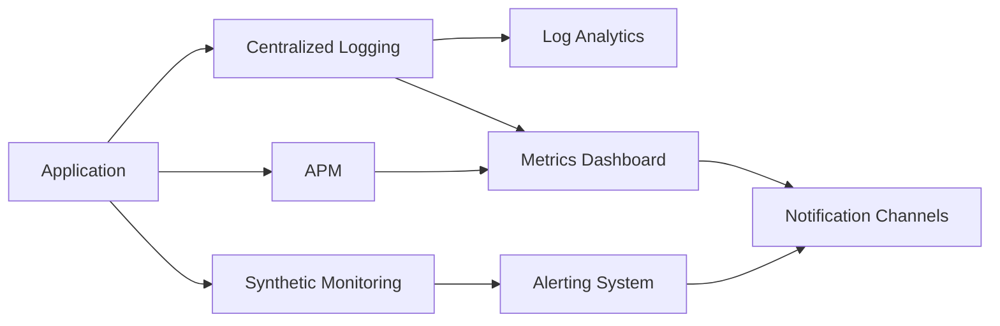

# MultiAgent Repository Monitoring Analysis

This analysis examines the provided repository's monitoring and observability setup, identifying current practices and recommending improvements for comprehensive monitoring.

## Current Monitoring and Observability Setup

The repository utilizes GitHub Actions for CI/CD and deployment to Azure.  Several workflows are present, indicating a focus on automation:

* **`azure-dev.yml`**: Validates Azure Bicep templates. This provides some level of infrastructure validation but lacks runtime monitoring.
* **`deploy.yml` & `deploy-waf.yml`**: These workflows deploy the application to Azure and include some rudimentary monitoring:
    * **Quota checks**:  `checkquota.sh` script performs quota checks before deployment, preventing deployments if insufficient resources are available.  This is a proactive monitoring step.
    * **Notification system**: Logic Apps are used to send email notifications upon deployment failure or quota issues. This provides basic alerting.
    * **Resource cleanup**:  The workflows attempt to delete the resource group and OpenAI resources after deployment, regardless of success or failure. This is crucial for cost management.  However, the cleanup process includes a retry mechanism to ensure complete resource deletion.
* **`docker-build-and-push.yml`**: Builds and pushes Docker images to Azure Container Registry (ACR).  No runtime monitoring of the containers is apparent.
* **CodeQL analysis (`codeql.yml`)**:  This workflow performs static code analysis, identifying potential vulnerabilities and code quality issues. This is a valuable part of proactive monitoring, focusing on code quality rather than runtime behavior.
* **Dependabot (`dependabot.yml`)**:  Automated dependency updates are managed, improving security and maintainability. This is indirect monitoring, focusing on dependency health.
* **Stale bot (`stale-bot.yml`)**:  This workflow manages stale issues and pull requests, helping to keep the repository clean and focused. This is not directly related to application monitoring but improves the overall development process.

**Missing Aspects:**

* **Application Performance Monitoring (APM):**  There's no evident APM solution integrated.  This is a critical gap, as it lacks real-time insights into application performance, including response times, error rates, and resource utilization.
* **Log Aggregation and Analysis:**  While the deployment workflows send notifications on failure, there's no centralized log aggregation and analysis system (e.g., Azure Monitor Logs, Splunk, ELK stack).  This makes troubleshooting and identifying issues difficult.
* **Metrics Dashboards:**  No dashboards are mentioned for visualizing key metrics related to application performance, resource usage, or deployment success rates.
* **Synthetic Monitoring:**  No synthetic monitoring is implemented to proactively check application availability and performance from various locations.

## Logging Patterns and Strategies

The current logging strategy is rudimentary.  Error messages are sent via email notifications, but there's no structured logging for debugging or analysis.  Implementing structured logging with detailed context (timestamps, error codes, request IDs, etc.) is crucial.

## Performance Monitoring Capabilities

The repository lacks comprehensive performance monitoring.  The quota check is a positive step, but it only addresses resource availability, not application performance.  APM tools should be integrated to monitor response times, throughput, and resource consumption.

## Error Tracking and Alerting Systems

The email notifications provide basic alerting, but they are reactive and lack context.  A more robust alerting system should be implemented, potentially using Azure Monitor Alerts or similar tools, to provide timely notifications based on specific thresholds and conditions.

## Metrics Collection and Dashboards

No metrics collection or dashboards are currently implemented.  This significantly limits the ability to track key performance indicators (KPIs) and identify trends.

## Recommendations for Comprehensive Monitoring and Observability

1. **Integrate Application Performance Monitoring (APM):** Implement an APM solution like Application Insights, Datadog, or New Relic to monitor application performance in real-time.  This will provide insights into response times, error rates, and resource usage.

2. **Centralized Logging:**  Implement a centralized logging system (e.g., Azure Monitor Logs) to collect and analyze logs from all components of the application.  Use structured logging to facilitate efficient searching and analysis.

3. **Metrics Collection and Dashboards:**  Define key metrics (e.g., request latency, error rate, CPU utilization, memory usage) and collect them using appropriate tools.  Create dashboards to visualize these metrics and identify trends.

4. **Enhanced Alerting:**  Configure alerts based on specific thresholds and conditions (e.g., high error rates, slow response times, resource exhaustion).  Use a robust alerting system that integrates with communication channels (e.g., PagerDuty, Slack).

5. **Synthetic Monitoring:**  Implement synthetic monitoring to proactively check application availability and performance from various locations.  This helps identify issues before they impact real users.

6. **Improve Logging in Existing Workflows:** Add detailed logging to the existing GitHub Actions workflows to provide more context during troubleshooting.

7. **Tracing:** Implement distributed tracing to track requests across multiple services and identify performance bottlenecks.

8. **Health Checks:** Implement health checks for all application components to proactively identify and address issues.

## Mermaid Diagram: Proposed Monitoring Architecture

This diagram illustrates a proposed architecture incorporating APM, centralized logging, metrics dashboards, synthetic monitoring, and a robust alerting system.  This enhanced monitoring setup will provide comprehensive observability into the application's health and performance.