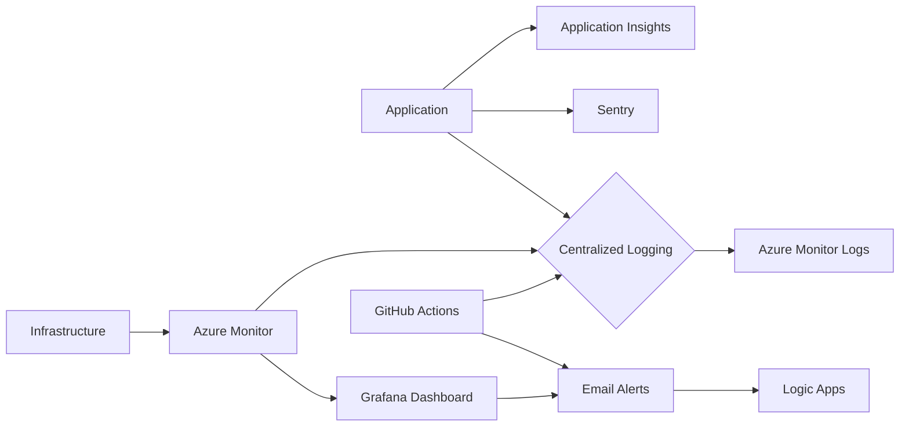

# MultiAgent Repository Monitoring Analysis

This analysis assesses the current monitoring and observability setup of the MultiAgent repository, identifies gaps, and provides recommendations for improvement.

## Current Monitoring and Observability Setup

The repository utilizes GitHub Actions for CI/CD and deployment to Azure.  Several workflows are present, indicating a degree of automation:

* **`azure-dev.yml`**: Validates Azure Bicep templates. This provides some level of infrastructure-as-code validation, but doesn't directly monitor the deployed infrastructure's health.
* **`deploy.yml` and `deploy-waf.yml`**: These workflows deploy the application to Azure, including resource group creation and deletion. They incorporate quota checks and send email notifications upon failure using Logic Apps.  This is a good starting point for alerting, but lacks comprehensive monitoring of the deployed application.
* **`codeql.yml`**: Performs static code analysis for security vulnerabilities. This is crucial for preventing issues but doesn't monitor runtime behavior.
* **`docker-build-and-push.yml`**: Builds and pushes Docker images to Azure Container Registry (ACR).  It uses historical tags, which is helpful for tracking deployments. However, it lacks monitoring of the container images' health and performance in production.
* **Other workflows**:  Handle release creation, Dependabot PR management, and stale issue/PR cleanup. These are valuable for development workflow management but do not directly contribute to application monitoring.

**Gaps:** The current setup focuses primarily on deployment and alerting on failures.  It lacks comprehensive monitoring of the application's runtime performance, resource utilization, and error tracking beyond simple failure notifications.  There's no centralized logging or dashboarding solution.

## Logging Patterns and Strategies

The workflows primarily rely on `echo` statements for logging within GitHub Actions.  This provides limited visibility into the deployment process.  Error messages are sent via Logic Apps to email, which is a basic alerting mechanism but lacks detailed context.  The application itself likely has its own logging, but this is not directly visible from the provided repository content.

**Recommendation:** Implement centralized logging using a service like Azure Monitor Logs or a similar solution.  This allows for aggregation, filtering, and analysis of logs from various sources (application, infrastructure, and CI/CD).  Structured logging (JSON) should be used to facilitate easier analysis.

## Performance Monitoring Capabilities

No dedicated performance monitoring is evident.  The workflows focus on deployment success/failure, not ongoing performance.

**Recommendation:** Integrate application performance monitoring (APM) tools like Application Insights or Datadog.  These tools provide metrics on response times, error rates, and resource utilization, enabling proactive identification of performance bottlenecks.  Consider adding synthetic monitoring to proactively detect issues before users report them.

## Error Tracking and Alerting Systems

The current error tracking relies on email notifications triggered by workflow failures. This is rudimentary and lacks detailed error information.

**Recommendation:** Implement a robust error tracking system using a service like Sentry or Rollbar.  These services provide detailed stack traces, error aggregation, and alerting capabilities.  Integrate them with the application and CI/CD pipeline for comprehensive error tracking and alerting.

## Metrics Collection and Dashboards

No metrics collection or dashboards are apparent.

**Recommendation:**  Use a monitoring solution (e.g., Azure Monitor, Grafana) to create dashboards visualizing key metrics such as:

* **Application performance:** Response times, error rates, request volume.
* **Resource utilization:** CPU, memory, network usage.
* **Deployment frequency and success rate:** Track the frequency of deployments and the success/failure rate of each deployment.
* **Infrastructure health:**  Status of Azure resources (e.g., VMs, databases).

## Recommendations for Comprehensive Monitoring and Observability

1. **Centralized Logging:** Implement a centralized logging solution (Azure Monitor Logs, Splunk, ELK stack) to collect logs from all components.
2. **Application Performance Monitoring (APM):** Integrate an APM tool (Application Insights, Datadog, New Relic) to monitor application performance and resource utilization.
3. **Error Tracking:** Use an error tracking service (Sentry, Rollbar) to capture and analyze errors, providing detailed context and alerting.
4. **Infrastructure Monitoring:** Monitor the health and performance of Azure infrastructure using Azure Monitor or a similar tool.
5. **Metrics Dashboards:** Create dashboards in a monitoring tool (Azure Monitor, Grafana) to visualize key metrics and provide at-a-glance insights into application and infrastructure health.
6. **Alerting:** Configure alerts based on critical thresholds for key metrics (e.g., high error rates, slow response times, resource exhaustion).  Use different alerting methods (email, PagerDuty, SMS) based on severity.
7. **Synthetic Monitoring:** Implement synthetic monitoring to proactively detect issues before users report them.
8. **Tracing:** Implement distributed tracing (e.g., using OpenTelemetry) to track requests across multiple services and identify performance bottlenecks.

## Monitoring Architecture Diagram (Mermaid)

This diagram illustrates a recommended monitoring architecture.  The application sends metrics and logs to various services, which are then aggregated and visualized on a dashboard.  Alerts are triggered based on predefined thresholds.  This setup provides a comprehensive view of the application's health and performance.