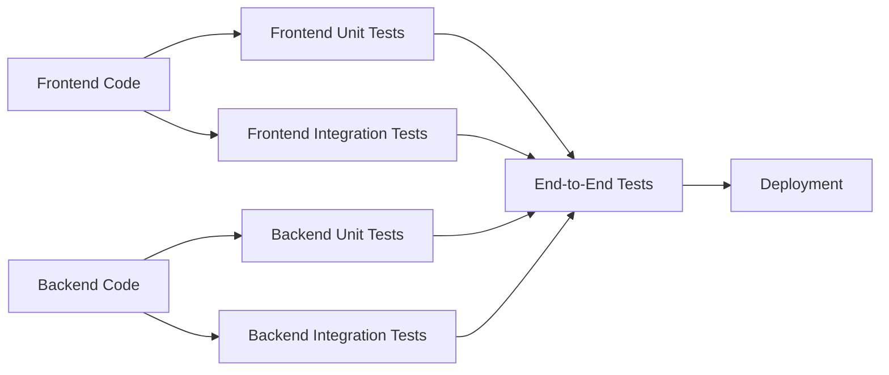

# TDD Analysis of MultiAgent Repository

This analysis assesses the provided codebase's adherence to Test-Driven Development (TDD) principles based on the available information.  The analysis is limited by the absence of actual test code within the provided files.  The presence of testing-related files and workflows suggests an intent towards testing, but the specifics of test implementation and coverage remain unknown.

## Current Test Coverage and Quality

The repository includes several files related to testing and CI/CD, indicating a planned testing strategy.  However, no actual test code is present in the provided files.  Therefore, we cannot assess the current test coverage and quality.  The `.github/workflows` directory contains various YAML files for different testing and deployment workflows, including:

* **`codeql.yml`**:  Performs static code analysis using CodeQL, identifying potential vulnerabilities and code quality issues.  This is not a direct measure of TDD, but it contributes to overall code quality, which is indirectly related to TDD's emphasis on maintainable and reliable code.
* **`pylint.yml`**: Runs Pylint on the backend Python code (`src/backend`), suggesting an attempt at static code analysis for Python code quality.  Again, this is not a direct measure of TDD but contributes to code quality.
* **`docker-build-and-push.yml`**: Builds and pushes Docker images.  While not directly related to TDD, it's crucial for deployment and integration testing.

## Test-Driven Development Practices

The absence of test code prevents a direct assessment of TDD practices.  The presence of testing frameworks in the `devcontainer.json` (e.g., `ms-vscode.js-debug`, `ms-python.python`) suggests that the development environment is set up for testing, but it doesn't confirm that TDD is actively followed.  To determine if TDD is being used, we need to examine the actual test code and its relationship to the production code.

## Testing Frameworks and Patterns Used

Based on the `devcontainer.json`, the following testing-related extensions are installed:

* **`ms-vscode.js-debug`**:  Suggests JavaScript debugging capabilities, implying the use of JavaScript testing frameworks (e.g., Jest, Mocha).
* **`ms-python.python`**:  Indicates Python development support, suggesting the use of Python testing frameworks (e.g., pytest, unittest).

However, without the test code itself, it's impossible to determine the specific frameworks and patterns used.

## Unit, Integration, and End-to-End Testing Strategies

The provided files don't reveal the specific strategies used for unit, integration, and end-to-end testing.  The presence of separate frontend and backend directories (`src/frontend`, `src/backend`) suggests that separate testing strategies might be employed for each.  However, without the test code, we can only speculate.

## Test Maintainability and Reliability

Without access to the test code, we cannot evaluate the maintainability and reliability of the tests.  Factors like test organization, naming conventions, and the use of mocking and stubbing would influence this assessment.

## Recommendations for Improvement

1. **Implement Test Code:** The most crucial step is to add actual unit, integration, and end-to-end tests.  The repository should include dedicated test directories within the `src/frontend` and `src/backend` folders.

2. **Choose Testing Frameworks:** Select appropriate testing frameworks for both frontend (e.g., Jest, Cypress) and backend (e.g., pytest, unittest) based on project needs and developer preferences.

3. **Adopt TDD Practices:**  Start implementing TDD by writing tests *before* writing the production code.  This ensures that the code is designed with testability in mind and that all functionalities are covered by tests.

4. **Define Test Coverage Goals:** Set realistic goals for test coverage (e.g., aiming for high unit test coverage and sufficient integration and end-to-end tests).  Tools like SonarQube or Codecov can help track coverage.

5. **Improve CI/CD Integration:** Integrate the testing frameworks into the CI/CD pipeline (`azure-dev.yml`, other `.github/workflows` files) to ensure that tests are run automatically on every code change.

6. **Maintain Test Suites:**  Regularly review and update the test suites to ensure they remain relevant and effective as the codebase evolves.  This includes refactoring tests to improve readability and maintainability.

7. **Implement Mocking and Stubbing:** Use mocking and stubbing techniques to isolate units of code during testing, making tests more reliable and less prone to breaking due to changes in other parts of the system.

8. **Document Testing Strategy:**  Create a document outlining the testing strategy, including the types of tests, coverage goals, and testing frameworks used.  This will improve collaboration and maintainability of the testing process.

## Mermaid Diagram (Illustrative -  No Test Code Available)

The following diagram illustrates a *potential* testing structure, assuming TDD is implemented.  The actual structure will depend on the specific implementation details.

This diagram shows a basic structure where unit tests are written for individual components, integration tests verify interactions between components, and end-to-end tests cover the entire system.  The absence of test code prevents a more accurate representation.